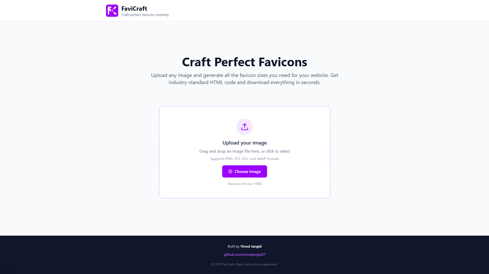

# FaviCraft

A modern favicon generator that creates all the favicon sizes you need for your website in seconds.



## Features

- **All Standard Sizes** - Generate 16x16, 32x32, 48x48, 96x96, 144x144, 192x192, 512x512px favicons
- **Apple Touch Icons** - Complete support for iOS devices and iPads
- **PWA Ready** - Android Chrome icons and manifest support
- **Multiple Formats** - PNG and ICO formats included
- **Ready HTML Code** - Copy-paste HTML with all required meta tags
- **Batch Download** - Download all files at once or individually

## Quick Start

```bash
# Clone the repository
git clone https://github.com/vinodjangid07/FaviCraft.git

# Navigate to project directory
cd FaviCraft

# Install dependencies
npm install

# Run development server
npm run dev
```

Open [http://localhost:3000](http://localhost:3000) to start generating favicons.

## Usage

1. **Upload** any image (PNG, JPG, SVG, WebP)
2. **Preview** generated favicons in all sizes
3. **Download** all files or select specific sizes
4. **Copy** the HTML code to your website's `<head>` section

## Tech Stack

- **Next.js 15** - React framework
- **TypeScript** - Type safety
- **Tailwind CSS** - Styling
- **Canvas API** - Image processing
- **Lucide React** - Icons

## Generated Files

- `favicon.ico` - Legacy browser support
- `favicon-16x16.png` to `favicon-512x512.png` - Standard sizes
- `apple-touch-icon-*.png` - iOS device support
- `android-chrome-*.png` - Android home screen icons

## Contributing

1. Fork the repository
2. Create your feature branch (`git checkout -b feature/new-feature`)
3. Commit your changes (`git commit -m 'Add new feature'`)
4. Push to the branch (`git push origin feature/new-feature`)
5. Open a Pull Request

## License

MIT License - feel free to use this project for personal or commercial purposes.

## Author

Built by [Vinod Jangid](https://github.com/vinodjangid07)
